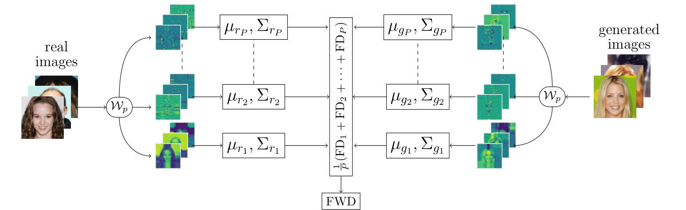

# Fréchet Wavelet Distance: A Domain-Agnostic Metric for Image Generation


[[Archive](https://arxiv.org/pdf/2312.15289)] [[Project Page](https://lokiv.dev/frechet_wavelet_distance/)]

_[Lokesh Veeramacheneni](https://lokiv.dev)<sup>1</sup>, [Moritz Wolter](https://www.wolter.tech/)<sup>1</sup>, [Hilde Kuehne](https://hildekuehne.github.io/)<sup>1,2</sup>, and [Juergen Gall](https://pages.iai.uni-bonn.de/gall_juergen/)<sup>1</sup>_

<sup>1</sup> University of Bonn,
<sup>2</sup> Goethe University Frankfurt and MIT-IBM Watson AI Lab.

Some text here

<div align="center">

</div>


# :hammer_and_wrench: Installation
Clone the repository using 
```
git clone git@github.com:Uni-Bonn-Attention-Research/frechet_wavelet_distance.git
cd ./frechet_wavelet_distance
```

# :test_tube: Requirements
All the requirements are specified in [requirements.txt](https://github.com/Uni-Bonn-Attention-Research/diffusion/blob/pytorch/requirements.txt) file.

# :school_satchel: Usage
```
export PYTHONPATH=.
python src/fwd.py <path to dataset> <path to generated images>
```
Here are the other arguments and defaults used.
```
python src/fwd.py --help

usage: fwd.py [-h] [--batch-size BATCH_SIZE] [--num-processes NUM_PROCESSES] [--save-packets] [--wavelet WAVELET] [--max_level MAX_LEVEL] [--log_scale] path path

positional arguments:
  path                  Path to the generated images or path to .npz statistics file.

options:
  -h, --help            show this help message and exit
  --batch-size BATCH_SIZE
                        Batch size for wavelet packet transform. (default: 128)
  --num-processes NUM_PROCESSES
                        Number of multiprocess. (default: None)
  --save-packets        Save the packets as npz file. (default: False)
  --wavelet WAVELET     Choice of wavelet. (default: sym5)
  --max_level MAX_LEVEL
                        wavelet decomposition level (default: 4)
  --log_scale           Use log scaling for wavelets. (default: False)
```
We conduct all the experiments with `Haar` wavelet with transformation/decomposition level of `4` for `256x256` image.

In future, we plan to release the jax-version of this code.

# :paperclip: Citation
If you use this repository in your research, please cite using the following bibtex entry.
```
Replace bibtex here after paper is updated.
```

# :star: Acknowledgments
The code is built with inspiration from [Pytorch-FID](https://github.com/mseitzer/pytorch-fid).
We use [PyTorch Wavelet Toolbox](https://github.com/v0lta/PyTorch-Wavelet-Toolbox) for Wavelet Packet Transform implementation.
We recommend to have a look at these repositories.

# :construction: ToDO
- [x] Project Page
- [ ] PIP package
- [ ] JAX version


# :heavy_plus_sign: Wavelet Power KL-Divergence (WPKL)
We also experimented with KLDivergence version and found that KLDivergence suffers from scaling issues.
Please refer to [link here](https://google.com/) here for its usage.
